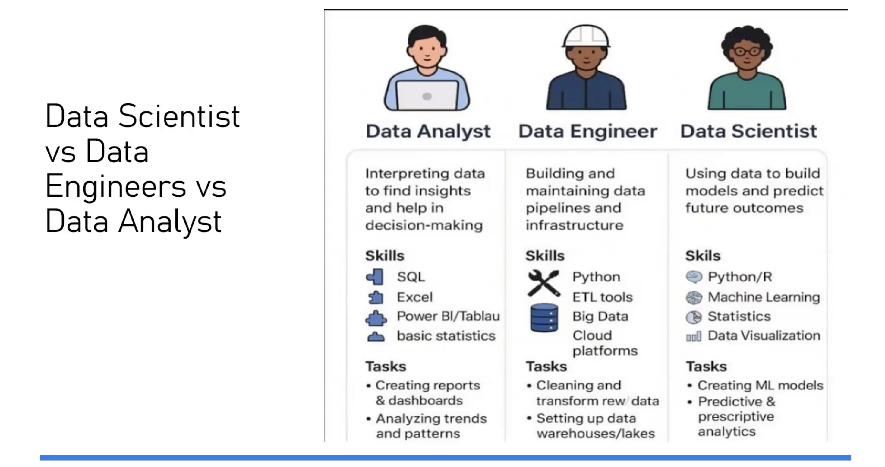

# Introduction to Agentic AI and Data Roles

## What is Agentic AI?

Agentic AI is an AI system that can do more than give a single reply.
It can take your prompt as a goal, plan steps, use tools, perform actions, check results, and keep going step by step until the job is completed.

## One-line definition

Agentic AI is goal-driven AI that uses prompts, planning, tools, memory, and feedback loops to take multi-step actions and complete tasks with minimal human guidance.

## Full explanation in simple words

### 1) Prompt

A prompt is your instruction to the AI.

Example prompt:

"Find 3 beginner courses on AI and make a 6-month study plan."

### 2) Goal and constraints

From your prompt, the AI identifies:

- The main goal (what to achieve)
- The limits (time, budget, format, and rules)

### 3) Planning

Instead of answering immediately, it creates a small plan.

Example:

1. Search courses
2. Compare courses
3. Build a schedule
4. Present the final plan

### 4) Tools

Tools are extra abilities the AI can use outside normal text generation.

Examples of tools:

- Web search
- Calculator
- Code execution
- File reading and writing
- Calling APIs
- Database lookup

Without tools, AI can mostly "talk."
With tools, AI can also "do."

### 5) Actions

The AI runs those tools to collect real information or perform real tasks.

### 6) Observation and feedback

After each action, it reads the result and checks:

- Did it work?
- Is anything missing?
- Did an error happen?

Then it adjusts the next step.

### 7) Memory

The AI keeps useful context while working.

- Short-term memory: what happened during this task
- Long-term memory (if enabled): user preferences and past decisions

### 8) Decision loop

It repeats this cycle:

**Plan** &rarr; **Act** &rarr; **Check** &rarr; **Improve**

This loop continues until the goal is reached or the process is stopped.

### 9) Guardrails and human control

Good agentic systems include safety controls, such as:

- Permission checks
- Blocked actions for risky operations
- Human approval for sensitive steps

## Quick difference

A normal chatbot mostly gives one response.
Agentic AI can run a workflow from start to finish.

## Data Analyst vs Data Engineer vs Data Scientist

This image compares three common careers in the data world. They all work with data, but each role solves a different part of the problem.

### Data Analyst

Main focus: understanding what already happened.

- Helps teams make decisions using reports and dashboards
- Finds trends and patterns in historical data
- Common skills: SQL, Excel, Power BI or Tableau, and basic statistics

Simple question they answer: "What is happening in the business right now?"

### Data Engineer

Main focus: building the data foundation.

- Creates and maintains data pipelines (automatic data movement systems)
- Cleans and transforms raw data so others can use it safely
- Sets up storage systems like data warehouses and data lakes
- Common skills: Python, ETL tools, big data systems, and cloud platforms

Simple question they answer: "How do we make data reliable and ready to use?"

### Data Scientist

Main focus: predicting what is likely to happen next.

- Builds machine learning models
- Uses statistics and experiments to test ideas
- Creates predictive systems (for example: demand forecast, churn prediction)
- Common skills: Python or R, machine learning, statistics, and visualization

Simple question they answer: "What will probably happen next, and why?"

### How these roles connect

In most teams, the flow looks like this:

**Raw Data** &rarr; **Data Engineer prepares it** &rarr; **Data Analyst explains it** &rarr; **Data Scientist predicts with it**

In small companies, one person may do parts of all three roles. In larger companies, these are usually separate jobs.
